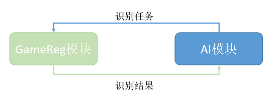

# 图像模块的二次开发

# 1 添加新的识别器

src\\ImgProc\\GameRecognize\\src\\Recognizer
目录下都是识别器的实现，如果我们想添加新的识别器，识别器的实现可以放在这个文件夹下。可以为此识别器创建独立的.h和.cpp文件。新的识别器的内容，主要如下。

# 1.1定义输入参数

	class CXXXParam : public IObjRegParam
	{
		……
	};

## 1.2定义识别器的结果输出

	class CXXXRegResult : public IObjRegResult
	{
		……
	};

## 1.3实现接口

	class CXXXReg : public IObjReg
	{
		public:
		CXXXReg();
		~ CXXXReg ();
		 // interface
		virtual int Initialize(IRegParam \*pParam);
		virtual int Predict(const tagRegData &stData, IRegResult \*pResult);
		virtual int Release();
		……
	};

# 2 处理新识别器

定义好新的识别器后，我们需要做一些处理工作到整个框架上，才能让识别器正常工作。

在AISDK中，Agent进程根据游戏需求发送识别任务到GameReg进程。所以我们需要在协议文件中增加此识别类型，并增加Agent端和GameReg端关于此识别类型任务的打解包处理。具体代码增加部分请详见以下内容。

## 2.1添加协议文件类型

Protocol/gameregProtoc.proto 添加识别器类型

	message tagPBResultRes
	{
	}
	enum EREGTYPE
	{
		TYPE_BEGIN = 0;
		……
		**TYPE_XXXREG = 13;**
		……
	};

2.2添加新类型创建新的识别器
---------------------------

src\\ImgProc\\GameRecognize\\src\\TaskMgr\\ TaskContext.cpp
    
	**bool TaskContext::CreateRecognizer(int nTaskID)**
	{
	    switch (m_stParms.GetType())
	    {
	        ……
	        case **TYPE_XXXREG**:
	        {
	            m_pRecognizer = new CMapReg();
	            LOGI("create MakReg reg");
	            break;
	        }
	    }
	}

## 2.3获取并实现识别器结果的句柄

src\\ImgProc\\GameRecognize\\src\\TaskMgr\\TaskResult.cpp

	IRegResult \*CTaskResult::GetInstance(EREGTYPE eType)
	{
		m_eType = eType;
		switch (eType)
		{
			……
			case **TYPE_XXXREG**:
			{
				Create**XXX**Rst();
				Break;
			}
			……
		}
	}
	
	void CTaskResult:: Create**XXX**Rst()
	{
		if (NULL == m_pRegRst)
		{
			m_pRegRst = CGameRegMemPool::getInstance()-\>AllocPoolMemory\<
			CXXXRegResult\>();
		}
	}

## 2.4 GameReg打解包实现

src\\ImgProc\\GameRecognize\\src \\SerializeProtobuf.cpp

对结果进行打包

	class CSerialFrameResult
	{
		……
		int SerialXXXReg(tagPBResult \*pstPBResult, CXXXRegResult \*pPixRegResult);
		……
	}

	//对参数进行解包
	
	class CUnSerialTaskMsg
	
	{
	
		……
		private:
		int UnSerialTaskMsgAgentXXXElmts(CXXXRegParam \*pParam, const tagPBAgentTaskTsk
		\&stPBAgentTaskTsk);
		……
	
	}

## 2.5 Agent端打解包函数

src\\API\\AgentAPI\\ AgentMsgMgr.py

	class MsgMgr(object):
	
		def _Register(self):
			#注册新类型打包函数
			self.__serialRegerHandle[MSG_REGER_XXX \_TYPE] = self._SerialXXXReg
			#注册新类型返回结果解包函数
			self.__unSeiralRegerHandle[gameregProtoc_pb2.TYPE_XXX] = self._UnSerialXXXResult
		
		# 打包函数的实现
		def _SerialXXXReg (self, taskPB, taskVal):
			……
		
		#解包函数的实现
		def _UnSerialXXXResult (self, result):
			……