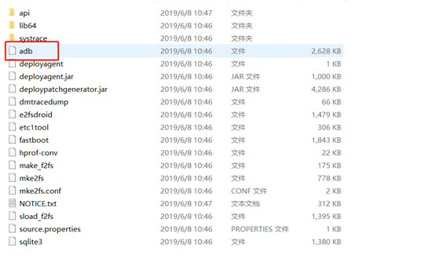

# 依次安装依赖项说明

[TOC]

## 1  安装相关依赖

```
sudo apt-get update

sudo apt-get -y --fix-broken install

sudo apt-get install build-essential cmake libgtk2.0-dev pkg-config python-dev python-numpy python3-numpy python-tk python3-tk libavcodec-dev libavformat-dev libswscale-dev autoconf automake libtool libgstreamer0.10-dev libgstreamer-plugins-base0.10-dev dos2unix libboost-dev libboost-thread-dev zlib1g-dev libjpeg-dev libwebp-dev libpng12-dev libtiff5-dev libjasper-dev libopenexr-dev libgdal-dev libdc1394-22-dev libtheora-dev libvorbis-dev libxvidcore-dev libx264-dev yasm libopencore-amrnb-dev libopencore-amrwb-dev libv4l-dev libxine2-dev libtbb-dev libeigen3-dev python3-pip python3-dev
```


## 2 安装nvdia-cuda 9.0 (可选执行，GPU版本需要)

这里使用cuda9.0的deb进行安装，因为cuda自带了显卡驱动，会自动安装显卡驱动，不需要单独安装显卡驱动。

-  到Nvidia官网下载cuda 9.0的deb安装文件


- 关闭与Nvidia内核不兼容的nouveau


```
sudo vim /etc/modprobe.d/blacklist-nouveau.conf
```

在文件中写入：

```
blacklist nouveau
blacklist lbm-nouveau
options nouveau modeset=0
alias nouveau off
alias lbm-nouveau off
```

接着依次执行以下命令

```
echo options nouveau modeset=0 | sudo tee -a /etc/modprobe.d/nouveau-kms.conf
sudo update-initramfs -u
sudo reboot
```

- 安装cuda


cd进入到cuda .deb安装位置

```
sudo dpkg -i cuda-repo-ubuntu1604-9-0-local_9.0.176-1_amd64.deb
sudo apt-key add /var/cuda-repo-9-0-local/7fa2af80.pub
sudo apt-get update
sudo apt-get install cuda
```

安装完毕后，打开home目录下 .bashrc文件，将cuda路径写入环境变量

在.bashrc文件中写入：

```
export PATH=$PATH:/usr/local/cuda/bin
export LD_LIBRARY_PATH=:/usr/local/cuda/lib64
```

执行source .bashrc 命令加载环境变量

- 验证cuda是否安装成功


```
cd /usr/local/cuda/samples/1_Utilities/deviceQuery
sudo make
sudo ./deviceQuery
```

运行测试代码，如果找到GPU则表明安装成功。

如果提示找不到cuda的so库，可能是环境变量没有重新加载。可以退出shell，重新进入shell，执行sudo ldconfig

## 3 安装cudnn 7.0(可选执行，GPU版本需要)

注册Nvidia的开发账号，然后才能下载cudnn 7.0。下载完成后执行以下命令：

```
tar -zxf cudnn-9.0-linux-x64-v7.tgz
cd cuda
sudo cp lib64/* /usr/local/cuda/lib64/
sudo cp include/cudnn.h /usr/local/cuda/include/
```

执行tar 解压cudnn包时如果有错误，可以忽略，只要需要的文件解压出来就OK

## 4 安装opencv 3.4.2

浏览器打开 https://opencv.org/releases/page/2/，下载Linux版本的OpenCV 3.4.2 ，在Linux下需要下载Sources版

  cd到下载目录

```
unzip opencv-3.4.2.zip
cd opencv-3.4.2
mkdir release   
cd release
cmake -D CMAKE_BUILD_TYPE=RELEASE -D CMAKE_INSTALL_PREFIX=/usr/local ..  
sudo make install
sudo ldconfig
```

注意在安装完cuda后，再进行opencv的编译安装，这样编译出来的opencv库进行了gpu加速.

## 5 安装protobuf 3.2.0

下载protobuf 3.2.0安装包，下载链接：https://github.com/protocolbuffers/protobuf/releases/tag/v3.2.0

```
tar -zxvf protobuf-cpp-3.2.0.tar.gz
cd protobuf-3.2.0/
./autogen.sh
./configure
make
make check
sudo make install
sudo ldconfig
```

如果会遇到以下问题：/autogen.sh: 40: autoreconf: not found

解决办法：

```
sudo apt-get install autoconf automake libtool
```

## 6 安装android adb工具集

adb工具下载链接如下所示：https://developer.android.com/studio/releases/platform-tools          

                     

选择对应操作系统的版本，下载后将其解压，得到adb可执行文件，将其路径加入PATH环境变量，或者将其拷贝至系统的可执行路径里（如/usr/bin），adb可执行文件如下图所示：



目前phone client 支持常见机型的 android8, android9版本。安装好adb之后，可以先验证下adb有没有安装成功。验证步骤如下：打开手机调试模式(以机型为VIVO X9 plus的手机为例, 进入“手机设置”-> "系统" ->"开发人员选项"，打开“开发人员选项”->"USB"调试->"USB调试（安全设置)" ->"显示点按操作反馈")，然后通过USB线连接手机，在终端输入命令:adb devices, 如果输出结果是已授权的手机设备序列号，则adb安装成功。

## 7 安装python3虚拟环境及python3依赖

pip3版本号小于9.0.3，需要升级pip3版本：

```
sudo pip3 install --upgrade pip
```

安装python3虚拟环境

```
sudo pip install virtualenv
sudo pip install virtualenvwrapper
```

编辑~/.bashrc添加以下内容：

```
  export VIRTUALENV_USE_DISTRIBUTE=1   
  export WORKON_HOME=~/.virtualenvs  
  export VIRTUALENVWRAPPER_PYTHON=/usr/bin/python3 
  source /usr/local/bin/virtualenvwrapper.sh
  export PIP_VIRTUALENV_BASE=$WORKON_HOME
  export PIP_RESPECT_VIRTUALENV=true
```

使环境变量立即生效：

```
source ~/.bashrc
```

创建python3虚拟环境(命名为game_ai_sdk)并进入虚拟环境：

```
mkvirtualenv game_ai_sdk
workon game_ai_sdk
```

在python3虚拟环境安装python3依赖：

找到AISDK根目录下的requirements.txt

```
cd {path to AISDK} //进入到SDK目录
sudo pip3 install -r requirements.txt //安装依赖
```

安装SDKTool的相关依赖:

`cd {path to AISDK} //进入到SDK目录`

`pip install -r requirements_SDKTool.txt // 安装依赖`