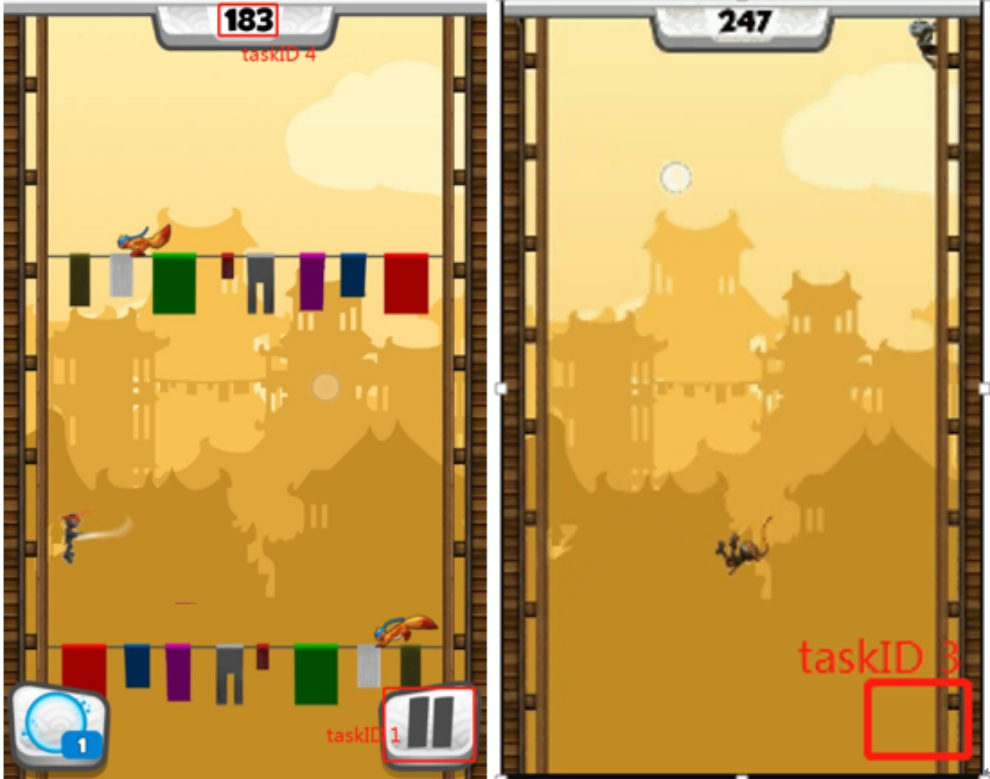

# **DQN模型训练**

DQN是一种强化学习算法，从随机的模型开始训练，训练过程中不断与实际游戏环境进行交互，交互过程中agent会尝试各种动作，好的动作会给予正向的reward，坏的动作会给予负的reward，通过agent与环境的大量交互逐渐学习到最优的AI模型。

平台内置了DQN强化学习算法，可以直接使用DQN算法训练AI模型。由于DQN训练要在实际游戏环境中进行，所以需要配置游戏UI，使游戏能够不断重复进入游戏场景；此外还需要游戏场景识别配置，通过识别游戏内特定的游戏元素（按钮、数字、血条等），设置游戏内训练开始、训练结束、以及设置reward奖励。

 

下面以<天天酷跑>游戏为例，说明如何使用内置的DQN算法训练游戏AI.

 

- 选择DQN AI算法

通过配置cfg/task/agent/AgentAI.ini文件内容如下，可以加载运行内置的DQN算法：

```
[AGENT_ENV]
UsePluginEnv = 0
EnvPackage = agentenv
EnvModule = DQNEnv
EnvClass = DQNEnv

[AI_MODEL]
UsePluginAIModel = 0
AIModelPackage = dqn
AIModelModule = DQNAIModel
AIModelClass = DQNAIModel

[RUN_FUNCTION]
UseDefaultRunFunc = 1
;RunFuncPackage = MyPackage
;RunFuncModule = MyModule
;RunFuncName = MyRunFunc
```

1. UsePluginEnv = 0 表示使用平台内置的Env插件
2. EnvPackage = agentenv 表示使用的Env插件的Package名（Python中Package名通常即为目录名）为agentenv 
3. EnvModule = DQNEnv 表示使用的Env插件的Module名（Python中Module名通常即为文件名）为DQNEnv
4. EnvClass = DQNEnv 表示使用的Env插件的Class名为DQNEnv
5. UsePluginAIModel = 0 表示使用平台内置的AI模型插件
6. AIModelPackage = dqn 表示使用的AI模型插件的Package名为dqn
7. AIModelModule = DQNAIModel 表示使用的AI模型插件的Module名为DQNAIModel
8. AIModelClass = DQNAIModel 表示使用的AI模型插件的Class名为DQNAIModel

 

- 场景识别配置

场景识别配置文件路径为cfg/task/gameReg/Task.json，DQN算法中需要配置4个识别任务，：

1. taskID为1的识别任务，配置为识别游戏开始，当检测到该任务为True时，开始AI模型训练；
2. taskID为2的识别任务，配置为识别游戏胜利，本游戏中不存在游戏胜利的情况，所以不需要配置该任务；
3. taskID为3的识别任务，配置为识别游戏失败，当检测到该任务为True时，停止AI模型训练；
4.  taskID为4的识别任务，配置为识别游戏画面上方的数字，根据跟数字来计算强化学习中的reward；

 

 

 

- 配置游戏动作

DQN算法支持离散型的动作类型，即每个动作id对应一个动作输出。通过修改cfg/task/agent/DQNAction.json文件来定义游戏内的动作，<天天酷跑>需定义的动作如下所示：

```
{

    "screenHeight": 360,
    "screenWidth": 640,
    "actions": [
        {
            "startRectx": 120, 
            "startRecty": 132, 
            "width": 240,  
            "height": 428,
            "contact": -1,			
            "type": 0, 
            "id": 0,
            "name": "None"
        },
        {
            "startRectx":501,
            "startRecty":228,
            "x":501,
            "y":228,
            "width":139,
            "height":132, 
            "contact": 0, 
            "type": 3, 
            "id": 1,
            "name": "jump",
            "durationMS": 50
        },
        { 
            "startRectx":1,
            "startRecty":222,
            "width":129,
            "height":138,
            "x": 1,  
            "y": 222, 
            "contact": 0, 
            "type": 3, 
            "id": 2,
            "name": "slip",
	        "durationMS": 50
        }
    ]

}
```

上述json文件共定义了三个动作：

1.  id为0的None动作类型，即游戏中不做任何动作
2.  id为1的click动作类型，即游戏中的跳跃动作
3.  id为2的click动作类型，即游戏中的滑动的动作

 

-  配置DQN算法参数

DQN算法包含一些训练参数，如学习率、replay memory大小、初始随机动作概率等，大部分情况下可以使用默认参数。通过修改cfg/task/agent/DQNLearn.ini文件可以修改算法参数：

```
[DQN]
QNetworkType = 2
InputImgWidth = 176
InputImgHeight = 108
StateRecentFrame = 4
TerminalDelayFrame = 6
RewardDiscount = 0.99
LearnRate = 0.000005
EndLearnRate = 0.000001
FramePerAction = 1
ObserveFrame = 10000
ExploreFrame = 1000000
InitialEpsilon = 0.01
FinalEpsilon = 0.001
QNetworkUpdateStep = 12000
MemorySize = 240000
ShowImgState = 0
MiniBatchSize = 32
TrainWithDoubleQ = 1
GPUMemoryFraction = 0.6
GPUMemoryGrowth = 0
CheckPointPath = data/trained-networks/
TrainFrameRate = 10
;RunType 0 for train, 1 for test
RunType = 1
```

1.  QNetworkType参数表示DQN神经网络结构，1表示Nature结构的神经网络，Nature结构的神经网络直接输出每个动作的价值；2表示Dueling结构的神经网络，Dueling将网络输出的价值分为状态价值和动作优势两部分；
2.  InputImgWidth和InputImgHeight表示训练输入图像的宽和高；
3.  StateRecentFrame = 4 表示将连续的4帧图像作为训练输入；
4.  TerminalDelayFrame = 6 表示训练过程中检测到的游戏结束比真实情况延迟了6帧；如果实际情况不存在延迟可以设置为0；
5. RewardDiscount 表示强化学习中reward的折扣系数；
6.  LearnRate 表示训练中的学习率；
7.  FramePerAction 表示多少帧输出一个动作，训练中发现某些游戏如果输出动作频率太高，将难于收敛；
8.  InitialEpsilon和FinalEpsilon  DQN训练采用ε-greedy策略，开始训练时有InitialEpsilon大小的概率采用随机动作，之后随机动作概率逐渐减小到FinalEpsilon；
9. ObserveFrame = 10000 表示收集10000帧的数据后才开始训练模型；
10. ExploreFrame = 1000000 表示经过1000000帧的训练后，随机动作概率降低到FinalEpsilon；
11. MemorySize 表示训练中的经验池replay memory大小；
12. ShowImgState 表示是否显示训练图像，0表示不显示，1表示显示；
13. MiniBatchSize 表示采用minibatch方式训练的batch大小；
14. TrainWithDoubleQ 表示表示是否采用Doule DQN方式训练，Doule DQN将动作选择和价值估计采用两个网络来进行，实践中采用Double DQN方式训练有更好的效果；
15. GPUMemoryFraction 表示训练中限制GPU显存比例；
16. CheckPointPath 表示训练的网络模型保存路径，确保已经创建了设置的保存路径；
17. TrainFrameRate 表示训练模型的FPS帧率；
18. RunType 表示DQN算法运行方式，0表示训练模型，1表示测试训练模型；

 

- 配置Reward奖励

强化学习训练过程中，根据环境反馈的reward进行模型训练。好的动作得到正的reward，差的动作得到负的reward。<天天酷跑>游戏中，可以根据游戏画面上方的距离数字作为游戏得分，并根据得分计算reward。得分增加表示agent一直在前进，给予正的reward；得分停止不变时表示agent死亡，给予负的reward。

其它游戏的reward计算方法，要根据实际情况来设置，总体的原则是好的动作给予正的reward，坏的动作给予负的reward。简单的reward计算，通过修改cfg/task/agent/DQNEnv.ini 可以来修改reward计算规则。<天天酷跑>游戏中，可以设置如下所示：

```
[IMAGE_ROI]
StartX = 0
StartY = 0
Width = 640
Height = 360

[REWARD_RULE]
InitScore = 0.0
MaxScoreRepeatedTimes = 4
RewardOverRepeatedTimes = -0.5
WinReward = 0.0
LoseReward = -0.5
MaxRunningReward = 0.5
MinRunningReward = -0.5
RewardPerPostiveSection = 0.1
RewardPerNegtiveSection = 0.0
ScorePerSection = 2.0
```

1.  StartX、StartY、Width、Height表示训练时输入给DQN训练算法的图像区域，本例中图像区域为整个游戏画面；
2.  InitScore 表示游戏开始时的初始得分；
3.  MaxScoreRepeatedTimes = 4、RewardOverRepeatedTimes = -0.5 表示当同一个得分数字重复超过4个连续帧时，给予的reward。本游戏中得分数字重复不变时，表示agent死亡，所以给予-0.5的reward；
4.  WinReward 表示检测到游戏胜利时，给予的reward值，由于本游戏中不存在游戏胜利结束的情况，可以设置为0；
5.  LoseReward 表示检测到游戏失败时，给予-0.5的reward；
6.  MaxRunningReward、MinRunningReward 表示游戏过程中给予的最大、最小reward值；
7.  ScorePerSection = 2.0、RewardPerPostiveSection = 0.1、RewardPerNegtiveSection = 0.0  表示2.0作为一个得分区间，当得分每增加一个区间给予RewardPerPostiveSection（本例为0.1） 的reward，当得分每减少一个区间给予RewardPerNegtiveSection（本例为0）的reward。
8. 由于本游戏中不存在得分减少的情况，设置RewardPerNegtiveSection为0；

 

-  AI模型训练

完成上述配置后，拉起运行AI SDK平台，重复进入游戏场景，在agent与游戏环境不断交互中进行DQN AI模型训练